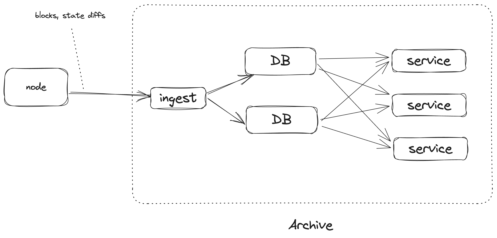
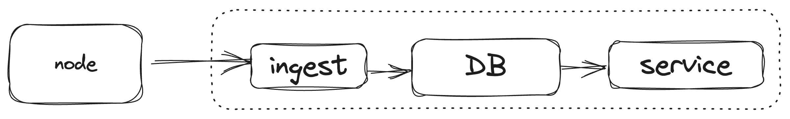

+++
title = "Rethinking historical storage"
date = "2023-09-25T16:16:22+02:00"
author = "pepyakin"
authorTwitter = "pepyakin"
cover = ""
tags = ["polkadot"]
description = "A proposal for more efficient archive nodes."
showFullContent = false
readingTime = true
hideComments = false
+++

Feel free to reply on [twitter](https://twitter.com/pepyakin/status/1706696616139182374) and [polkadot forum](https://forum.polkadot.network/t/rethinking-historical-storage/4059).

## Intro

In a multichain environment like Polkadot, you often need to query the RPC of all involved L2s. This often entails syncing around 60 nodes — a tedious task.

Luckily, I found that OnFinality provides RPC API for most of them. It's really a great tool that relieves you of this pain!

I noticed it has some performance issues though and it's not cheap!

Although I don't have inside information on their architecture, my observations of the RPC API behavior lead me to believe they're likely using multiple archive nodes potentially with a cache layer.

But even if there is a custom infrastructure, and I just encountered a bug, I think it would be still beneficial to democratize access to historical data. Even though this is written in the context of Polkadot, I think it applies to other chains as well.

## Horizontal Scaling

I had a couple of observations:

1. Trie is not necessary.
2. The archive data is immutable.

The existing archive software is just a Substrate node that doesn't prune historical states. Substrate stores its state in a trie (very similar to Merkle Patricia Trie of Ethereum). Specifically, it stores the state in a literal trie and access to a specific state is done by traversing the trie. There are optimizations like extension nodes and so on, but the gist is the same. The trie is optimized for the merkle root calculation.

While the efficacy of this approach for full nodes may be up for debate, it's certainly suboptimal for archive nodes.

The definition of an archive is that it can answer queries about the state at any point in time. Sure, trie supports that, but there is a way simpler and more efficient way to do that: just store the last time each key-value pair was changed.

| block_num | key | value |
|------|---|---|
10  | alice_balance | 100
20  | bob_balance | 50
30  | alice_balance | 25
30  | bob_balance | 125

This approach doesn't require storing the intermediate nodes. It's just a bunch of key-value pairs. The only thing that is required is to store the block number when a key-value pair is changed. This is a very simple data structure that can be easily stored in any kind of database and accessed efficiently. Moreover, this enables powerful features such as querying all block numbers where a specific account was changed. Although it must be noted, some work is required to make it work in the presence of re-orgs.

Given that archive data is immutable, scaling is straightforward — just add more replicas.

## Design Space

We are at the point where we see node software specialized for a particular use case. Archive
software should not be an exception. I envision that the archive software should be a standalone
program, that is specialized for the archival use case. It doesn't mean that it has to reimplement all the logic.
It's acceptable, though, if it relies on the full node to do the heavy lifting of syncing and executing, and
the archive just queries the full node.

The archive software should be roughly doing the following things:

1. Ingest the raw chain data
2. Transform the raw chain data.
3. Persist the transformed data.
4. Serve queries to the transformed data.

By the raw chain data, I mean things like blocks, storage changes, etc. The transformed data is the data that is useful for the user. For example, the transformed data could be the balance of an account at a specific block.

The archive could be split up into the following components:

- The blockchain node. Handles the syncing and the execution.
- The ingester is a component that fetches the raw chain data from the blockchain node.
- The service is a component that provides the raw API.
- The database is self-explanatory.

Note that these elements are components and not necessarily standalone programs. For example, the ingester and the service could be a single program. The database could be embedded or be a cluster of databases.

In this section, I'll outline a potential implementation for these components. It's worth noting that I haven't yet implemented any of these ideas. Take all of this with grain of salt. I am putting them out here just to lay out the design space. Further research is required to find the optimal solution.

## SQL is all you need

Let's consider a simple implementation.

In this implementation, we would heavily rely on a good old off-the-shelf relational database (RDBMS), such as Postgres.

The ingester would fetch the raw chain data from the blockchain node, specifically, blocks and state diffs. It would insert them into the RDBMS, using SQL statements.

The service is a stateless server that would provide the data stored in the RDBMS. The interface is likely to be JSONRPC to make it compatible with existing clients such as Polkadot.js. Other options such as GraphQL are possible to provide a Subsquid-like API.

What are the scalability properties of this system?

Ingestion won't be the bottleneck. I think it's safe to assume that the ingester can always keep up with the node. All the blocks and state diff would make up to a dozen megabytes tops per block time. It's improbable that the service would be the bottleneck. In case it is, some dumb in-memory caches could relieve it from pressure. If needed, it can be easily scaled horizontally trivially because it is stateless.

The most likely bottleneck would emerge in reading from the RDBMS. However, this issue is trivial to address by simply adding more read replicas. The number of replicas you can have varies, but as a rough estimate, a single replica can handle up to 10,000 requests per second. At some point, the main replica won't be able to keep up with
propagating the writes, but I am bearish if you can reach this point.

If you think you will, then you can just replicate the whole setup once more. You can even reuse the same blockchain node if you want to. It looks like it can handle multiple ingesters.

Now, how hard is the engineering part?

I assume that implementing the ingester would be straightforward: fetching blocks and state diffs, then breaking them down into a series of SQL statements, doesn't appear to be a significant challenge.

The service would be a bit harder. A JSONRPC API would have to be implemented on top of the RDBMS backend. Still doable.

One part that would require some work is extracting the state diffs from the node. In Substrate, there is already a `state_traceBlock` RPC call. I am not entirely a fan of it, it is too specialized for a more specific use case, but it will do[^subscan-is-happy]. This endpoint requires re-execution of the block to extract the state diff and that might pose a problem in case there is more than one ingester. It can be solved by designating one main ingester that will query it and then share the ready state diff with other ingesters or a cache could be introduced on the node side. But that's a problem for another day.

[^subscan-is-happy]: Well at least Subscan can get away with [it](https://polkadot.subscan.io/extrinsic/0x9dc7de40d0d44bf4e2a5c3ae1a69becb2f182341ea00124b1ce07acd9be2d780?tab=state_tracing).

A more pressing problem is that RPC nodes are expected to provide APIs that depend on execution, such as `state_call`.
In the outlined solution, the blockchain node handles the execution. That means that to execute `state_call` the service will need to delegate execution to the blockchain node, which would eliminate all the scalability benefits.

To solve this problem, the service will need to gain the capability of executing the state machine[^state-machine] directly. The storage of the execution should be backed by the RDBMS. Right now, extracting the state machine part of Substrate is not a trivial task and would require solving some engineering challenges.

[^state-machine]: The state machine term encompasses the execution of Runtime and the storage. So basically in this case, it's something that can execute a given block and return its state diff.

Maintaining the project should be relatively easy, again thanks to the RDBMS: it can be tuned, migration is easier, and there are a bunch of tools to administer and monitor it.

## Alternative Design

Just for the sake of completeness, I want to briefly discuss an alternative design.

This design is based on a locally embedded DB. It can be relational (such as SQLite) or KV (such as RocksDB). The former would inherit some of the benefits of the RDBMS, but the latter has the potential to be more efficient at the cost of more engineering effort. The service and the ingester live in the same process.

Thanks to the largely incremental nature of the data, adding more replicas should be feasible, albeit requiring significant effort

This design has the benefit that the data is close to the service making execution more efficient. Another thing is that potentially it could support more efficient scaling. In the RDBMS case, you would probably need to rely on beefy SQL machines, whereas, in the embedded DB case, you could use a bunch of smaller machines. This is speculative, so I wouldn't give it too much weight.

## Conclusion

The current archive node software is not scalable, mainly because of storing the data in a trie. By flattening the data, we can make it more efficient to access and scale.

While the concepts outlined are primarily theoretical at this point, they offer a promising direction for future development and research in blockchain archiving.
